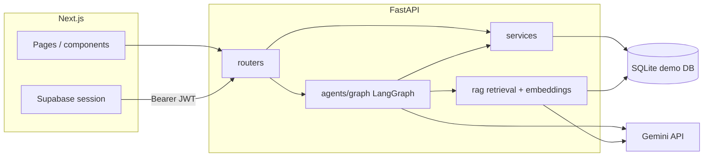
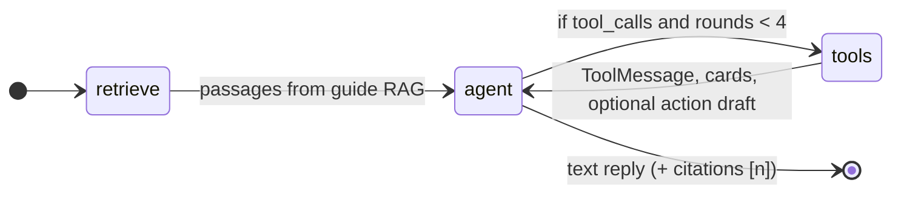

# Aangan: Architecture

## Stack
| Layer | Choice | Why |
|---|---|---|
| Frontend | Next.js (App Router, TypeScript), Tailwind, shadcn/ui | Deployed on Vercel |
| API | FastAPI + Pydantic v2 | Validation and structured errors built in |
| Database | **SQLite (aiosqlite) for demo/local** → **PostgreSQL at scale** | Today: one file (`backend/.demo/aangan.db`) for zero-setup clones. Production plan: Postgres (e.g. Supabase) with `asyncpg`, same Alembic migrations and service layer. Guide vectors today: float32 blobs in SQLite; hybrid search (cosine + BM25, rank-fused) in Python. At scale: **pgvector** + HNSW (or equivalent) instead of in-process scoring |
| ORM / migrations | SQLAlchemy 2.0 async + Alembic | Migrations required by the brief |
| Auth | Supabase Auth (email/password + Google); FastAPI verifies the JWT | Social login; authorisation stays in our API |
| Cache / rate limits | Redis (Upstash) when reachable, in-process fallback | Rate limits, repeated LLM answers |
| Jobs | FastAPI background tasks (arq later if needed) | Document ingestion, reminders |
| AI | Google Gemini via LangGraph + langchain-google-genai | Saarthi: answers, tools, confirmations (interrupts) |
| Tracing | our `llm_calls` table, plus Langfuse when keys are set | Per-request traces, cost and latency dashboard |
| Integrations | Razorpay (+ webhooks), Resend, Twilio WhatsApp sandbox | 2+ integrations with retries and webhooks |
| Deploy | Railway/Render (API + worker), Vercel (frontend), GitHub Actions CI | |

## System diagram



## Request flow
1. App sends request with Supabase access token.
2. FastAPI verifies the token, loads the user's approved membership (society_id, role).
3. Router calls a service; the service always filters by the member's society_id.
4. Typed response, or `{code, message}` error.

Saarthi requests follow the same path into LangGraph. **Agent tools wrap the same services**, run with the calling user's permissions, and never use raw SQL.

## SQLite → Postgres migration (same architecture)

- **Why SQLite now:** judges and contributors run `uv sync`, `alembic upgrade`, and `seed.py` without provisioning Postgres. The frontend can also run on static JSON or `frontend/.demo/demo.db`.
- **What moves unchanged:** routers, services, Pydantic schemas, LangGraph graph, tool specs, and society_id scoping.
- **What changes with Postgres:** `DATABASE_URL` dialect, array/JSON column types in `app/models/types.py`, booking overlap constraints (native `tstzrange` + EXCLUDE), and guide search moving from Python-side hybrid scoring on blob embeddings to **pgvector** indexes for larger multi-society deployments.
- **Auth:** Supabase Auth stays the identity provider; Postgres holds app data, not Supabase Auth users.

## Backend layout
```
backend/app/
  main.py
  core/          config, db, errors, logging, redis
  auth/          token verification, current_user, current_member, require_role
  models/        SQLAlchemy tables
  schemas/       Pydantic types
  routers/       societies, community, events, amenities, tickets,
                 marketplace, payments, notifications, assistant, admin, webhooks
  services/      business logic (shared by routers and agents)
  agents/        Saarthi: prompts/saarthi.md (persona), llm, graph, pricing, tracing, tools/
  rag/           ingest, chunking, retrieval
  integrations/  razorpay, resend, whatsapp
  workers/       arq jobs
backend/alembic/  migrations
backend/evals/    dataset + runner
backend/tests/
backend/scripts/seed.py
```

## Data model
Every table except `users` has `society_id`; every query filters on it.

**Identity**
- `users`: supabase_uid, email, phone, name, avatar_url
- `societies`: name, city, address, invite_code, plan, settings
- `towers`, `flats`
- `memberships`: user_id, society_id, flat_id, role (owner/tenant/landlord/committee/admin), status (pending/approved/rejected). Unique (user_id, society_id)
- `profiles`: bio, interests[], is_visible (default false), show_flat (default false)

**Community**
- `groups`, `group_members`
- `whatsapp_groups` (invite_link only returned after approved join request)
- `join_requests` (target_type group/whatsapp)
- `posts` (group_id null = society feed; post_type incl. committee-only `notice`, which feeds the Home digest; pinned), `comments`, `reactions`

**Events and payments**
- `events`: type (free/paid/society), host_id, amenity_id, starts_at, ends_at, capacity, price (paise), status (draft/pending_approval/published/cancelled/completed)
- `event_tickets`: covers RSVPs and paid tickets; status reserved/confirmed/cancelled
- `stall_applications`: stall_type, fee, spot_no, status
- `payments`: purpose (ticket/stall), amount computed server-side, razorpay ids (unique), status
- `webhook_events`: event_id unique, for idempotency

**Amenities**
- `amenities`: type, capacity, open_hours, rules {slot_minutes, max_hours_per_week, advance_days, requires_approval}
- `amenity_bookings`: time_range tstzrange with EXCLUDE constraint (no overlaps)
- `amenity_status`: crowd_level, note

**Help desk**
- `tickets`: per-society number (HD-1042), category, scope my_flat/common_area, tower, urgency, status, assigned_vendor_id, awaiting_confirmation. Common-area issues are visible society-wide; flat issues only to followers and the committee
- `ticket_followers`: reporter plus every "Me too" (the reporter count)
- `ticket_updates`: kind, actor_role resident/committee, message
- `vendors`, `feedback` (anonymous feedback stores no user)

**AI and system**
- `documents` (handbook, minutes, notices; committee notices link to a Home notice post), `document_chunks` (section label for citations, anchor, 768-d Gemini embedding)
- `chat_sessions` (per resident, soft delete), `chat_messages` (citations, cards, feedback)
- `agent_runs`, `approvals` (action_type, payload, status)
- `notifications` (priority critical/normal, channel)
- `llm_calls` (purpose, model, tokens, cost, latency, outcome, trace_id, detail)
- `saarthi_actions`: every change Saarthi proposes (tool, service-ready payload, card, status proposed/executed/pending_approval/cancelled/failed/expired). Nothing runs until the resident confirms; the row is also the audit trail
- `listings`, `audit_log`

**Key indexes:** society_id everywhere; (society_id, starts_at) on events; exclusion constraint on bookings (Postgres-native; SQLite uses app-level checks where needed); unique Razorpay and webhook ids. **Vector index:** HNSW on `document_chunks.embedding` is the **Postgres/pgvector** target; the SQLite demo stores embeddings as blobs and scores in Python (`app/rag/retrieval.py`).

## Saarthi (LangGraph + Gemini)

Full requirements: `SAARTHI-REQUIREMENTS.md`. Models come from config: `GEMINI_MODEL_MAIN` for chat, `GEMINI_MODEL_FAST` for summaries, form fill and fallback, `GEMINI_EMBED_MODEL` for the guide. Each call times out, retries once, then falls back to the other model. Chat streams over SSE (`POST /v1/saarthi/chat`).

### Chat graph



Nodes (`app/agents/graph.py`):

| Node | Responsibility |
|------|----------------|
| `retrieve` | Embed/query hybrid search for the resident's society; inject passages into the system prompt |
| `agent` | Stream Gemini reply; bind read + write tool schemas unless round cap or action already proposed |
| `tools` | Execute read tools via services; write tools only **propose** → `saarthi_actions` confirmation card |

Write execution path (outside the graph loop): resident taps Confirm → `POST /v1/saarthi/actions/{id}/confirm` → same `execute_*` handlers as the UI.

### RAG pipeline (society guide)

1. **Ingest** — Markdown/PDF from `society-guide/` seed and committee uploads (`app/services/guide.py`, `app/rag/chunking.py`, `app/rag/pdf.py`).
2. **Chunk** — Split on headings; keep tables intact; store label + anchor for citations.
3. **Embed** — Gemini embedding model; vectors persisted on `document_chunks`.
4. **Retrieve** — Cosine similarity + BM25, reciprocal rank fusion (`app/rag/retrieval.py`); relevance gates in config drop weak matches so Saarthi can say "not in the guide".

Live "what's happening" questions **never** use RAG; they use read tools only.

**Fill with Saarthi** (`POST /v1/saarthi/fill`): every create and edit form has a one-line box. The fast model returns that form's fields via structured output (`app/agents/fill.py`); `app/services/saarthi_fill.py` cleans them against the form's limits and adds live hints from existing services: event space clashes and the 10:30 PM hall cap, a "Me too" on a similar open issue, a marketplace price range. In edit mode (`current`, `itemId`) only the changed fields come back. It never submits; filled fields carry a sparkle until the resident edits them. Logged to `llm_calls` with purpose `fill`.

**Home "Today"** (`GET /v1/saarthi/today`): facts from existing services (notices, my bookings and events today, events filling up that match my interests, urgent issues in my tower) summarised by the fast model in 2–3 sentences. Cached per resident for the IST day under a fingerprint of those facts, so it is written once in the morning and again only when something important changes.

**AI usage** (`GET /v1/saarthi/usage`, committee only): per-day requests, tokens, estimated cost (USD and rupees), p50/p95 latency and failures from `llm_calls`; thumbs up/down from `chat_messages`; top questions the guide couldn't answer.

**Evaluation:** `backend/evals/cases.yaml` (guide, live, actions, fill, safety) and `evals/run.py`, which drives the real API on a fresh seeded database and writes a dated report. CI (`.github/workflows/ci.yml`) runs lint and tests on every push and the eval when the AI layer changes. `GEMINI_REASONING_EFFORT=low` is the default: it cut tool-turn p50 from 6.3 s to 4.4 s with the same score.

Planned agent roles:
- **Supervisor:** small, fast model routes to a specialist (structured output).
- **Amenity agent:** availability, rules, booking.
- **Event agent:** plans events, picks venue and time, drafts, invites matching residents.
- **Ops agent:** triages new tickets, dedupes, suggests vendor.
- **Connection agent:** interest matching for people and groups.
- **Society guide:** RAG over `society-guide/` documents with citations.
- **Approvals:** risky actions (see PRODUCT.md) create an `approvals` row and interrupt the graph; committee approve/reject resumes it.
- **Memory:** chat history from `chat_messages`; a LangGraph SQLite checkpointer (separate file) arrives with confirmations.
- **Models:** router model, main model, fallback model, all from config. Retry once, then fall back.
- **Safety:** user content and document text passed as data inside delimiters; tools validate arguments; an agent can never change its own society or role.

## Build order
1. Skeleton, identity, auth, seed, deploy + CI
2. Amenities
3. Community
4. Events + stalls
5. Razorpay payments + webhooks
6. Help desk
7. Notifications + worker
8. Agents
9. Saarthi society guide (RAG)
10. Evals, rate limits, cost dashboard

Detailed task prompts: `docs/build-prompts.md`.
