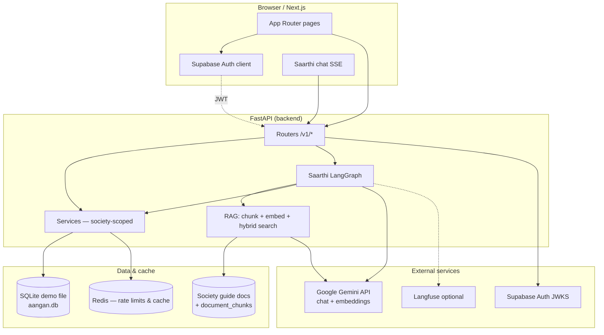
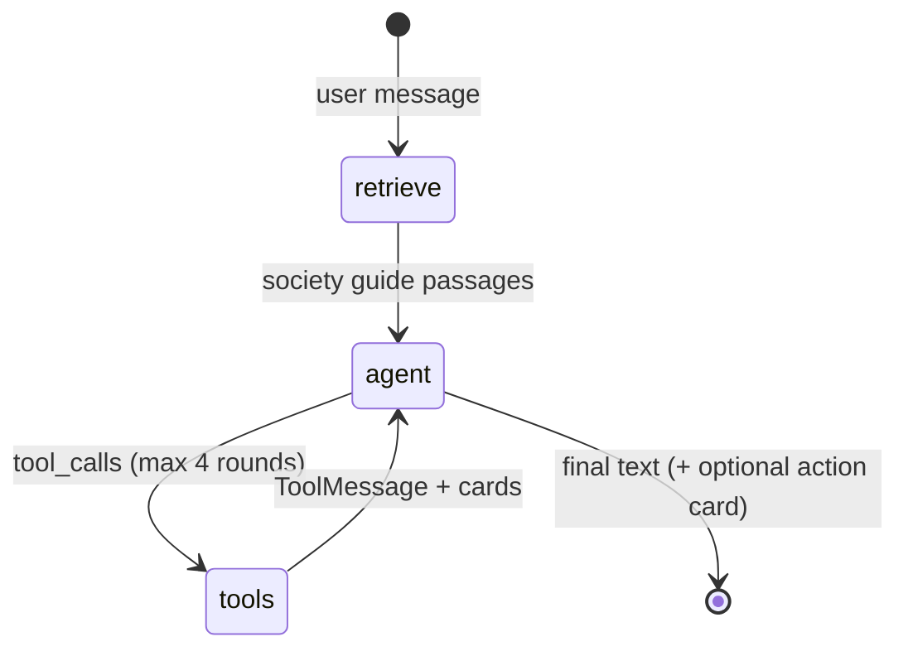

# Aangan (Living+)

Community app for Indian gated housing societies. Residents join interest groups, find WhatsApp groups, host events (with food stalls), book amenities, raise help-desk tickets, use a marketplace, and chat with **Saarthi**, the AI guide. Committee members approve events, stalls, members, and agent-proposed changes.

**Demo society:** Prestige Meridian Park, Gurugram (seed data).

---

## Run locally

You need **Node.js 18+** for the frontend. For the API and Saarthi, add **[uv](https://docs.astral.sh/uv/)** (Python 3.12). **Redis** is optional locally (`redis://localhost:6379/0`); rate limits fall back to in-process counters if Redis is unreachable. **Supabase** is required for real login (email/password and/or Google).

### Option A — Frontend only (fastest)

Bundled mock JSON and an optional writable SQLite demo store — no FastAPI required.

```bash
cd frontend
npm install
cp .env.example .env.local
```

In `frontend/.env.local`:

| Variable | Typical local value |
|----------|---------------------|
| `NEXT_PUBLIC_DATA_SOURCE` | `static` |
| `NEXT_PUBLIC_API_URL` | `http://localhost:8000` (unused in static mode) |
| `NEXT_PUBLIC_SUPABASE_URL` / `NEXT_PUBLIC_SUPABASE_ANON_KEY` | Your Supabase project (login/join) |

From the repo root or `frontend/`:

```bash
npm run dev
```

Open [http://localhost:3000](http://localhost:3000). Optional demo DB seed:

```bash
cd frontend && npm run demo:seed
```

See [`frontend/.env.example`](frontend/.env.example) for `DEMO_LOCAL_STORE` and SQLite path overrides.

### Option B — Full stack (Next.js + FastAPI)

The API uses **SQLite** on disk (`backend/.demo/aangan.db`) for local and demo deployments. See [Database](#database-sqlite-today-postgres-at-scale) below.

**1. Backend**

```bash
cd backend
uv sync
cp .env.example .env
# Set DATABASE_URL, SUPABASE_URL, FRONTEND_ORIGIN, REDIS_URL; add GEMINI_API_KEY for Saarthi
uv run alembic upgrade head
PYTHONPATH=. uv run python scripts/seed.py
uv run uvicorn app.main:app --reload --port 8000
```

Health: `curl http://localhost:8000/v1/health` → `{"status":"ok","db":true}`  
API docs: [http://localhost:8000/docs](http://localhost:8000/docs)

**Local dev without JWT** (read/write as the seeded demo user):

```env
ENV=local
LOCAL_DEV_AUTH_EMAIL=demo@aangan.app
```

**2. Frontend**

```env
NEXT_PUBLIC_DATA_SOURCE=api
NEXT_PUBLIC_API_URL=http://localhost:8000
```

Restart `npm run dev` after changing env.

**Guest join codes** (one use each; reset with `seed.py`): `PMG-7H4K` (C-702), `PMG-9R2N` (A-101), and others in [`backend/README.md`](backend/README.md). Reusable demo code: `LIVING-OPEN-50`.

More backend detail: [`backend/README.md`](backend/README.md).

### Option C — Saarthi eval (real Gemini)

Requires `GEMINI_API_KEY` in `backend/.env`. Builds a fresh seeded DB and scores 50+ cases (guide, live tools, actions, fill, safety):

```bash
cd backend && uv run python -m evals.run
```

Reports land in [`backend/evals/reports/`](backend/evals/reports/). CI runs the same when the AI layer changes (repository secret `GEMINI_API_KEY`). Latest benchmark: **98%** overall, **100%** safety — [2026-10-04 report](backend/evals/reports/2026-10-04.md).

---

## Architecture

High-level system diagram (request path and Saarthi):



**Layers:** `routers` (HTTP only) → `services` (business logic, always filtered by the member’s `society_id`) → `models`. Saarthi **never** bypasses services or writes SQL directly.

**Full write-up:** [`ARCHITECTURE.md`](ARCHITECTURE.md) — stack table, data model, tool lists, build order, and planned multi-agent roles.

### Database: SQLite today, Postgres at scale

| | **Now (demo / local / small deploy)** | **Planned (production scale)** |
|---|----------------------------------------|--------------------------------|
| Engine | **SQLite** via `aiosqlite` (`DATABASE_URL=sqlite+aiosqlite:///...`) | **PostgreSQL** (e.g. Supabase) via `asyncpg` |
| App data | Single file under `backend/.demo/` | Managed Postgres with connection pooling |
| Guide vectors | Embeddings stored as **float32 blobs**; hybrid **cosine + BM25** rank-fusion scored in Python (a society guide is hundreds of chunks, not millions) | **pgvector** with **HNSW** (or equivalent) for embedding search at larger corpora and multi-tenant load |
| Migrations | Alembic (same revision chain; dialect-specific types isolated in `app/models/types.py`) | Same Alembic workflow against Postgres |
| Frontend-only demo | Optional `frontend/.demo/demo.db` when `NEXT_PUBLIC_DATA_SOURCE=static` | N/A |

The repo is intentionally runnable without a cloud database so judges and contributors can clone and start in minutes. Production targets Postgres for concurrency, backups, and vector indexes — not a different product architecture.

---

## Saarthi (AI agents)

Saarthi is the resident-facing AI layer. Product spec: [`SAARTHI-REQUIREMENTS.md`](SAARTHI-REQUIREMENTS.md). Implementation lives under `backend/app/agents/`, `backend/app/rag/`, and `backend/app/services/saarthi_*.py`.

### What Saarthi does

1. **Answer** — Society rules from the indexed **society guide** ([`society-guide/`](society-guide/), plus committee-uploaded notices) with **citation chips**. “What’s happening now” from **live read tools** over the same services as the UI (events, bookings, tickets, marketplace, etc.).
2. **Act** — **Write tools** build a **proposal** only; the resident confirms on a card; `saarthi_actions` runs the same service code as the app screens.
3. **Fill** — “Fill with Saarthi” on create/edit forms: fast model + structured output (`app/agents/fill.py`), validated in `saarthi_fill.py`.

Persona and voice: [`backend/app/agents/prompts/saarthi.md`](backend/app/agents/prompts/saarthi.md). Avatar: [`saarthi-animated/`](saarthi-animated/) (SVG + CSS), used in the frontend.

### Chat agent graph (LangGraph)

Single compiled graph for conversational turns (`app/agents/graph.py`):



1. **retrieve** — Hybrid search over the resident’s society guide (`app/rag/retrieval.py`).
2. **agent** — Gemini streams the reply; may call tools. Primary model from `GEMINI_MODEL_MAIN`, fallback `GEMINI_MODEL_FAST`, timeout and one retry per model (`app/agents/llm.py`).
3. **tools** — Read tools return JSON + UI **cards**; write tools call `record` → confirmation card (at most one write proposal per turn).

Streaming: `POST /v1/saarthi/chat` (SSE). History in `chat_sessions` / `chat_messages`.

### Other AI paths (no LangGraph loop)

| Feature | Endpoint | Code | Model role |
|---------|----------|------|------------|
| **Today on Home** | `GET /v1/saarthi/today` | `app/agents/today.py`, `saarthi_today.py` | Fast model summarises facts gathered from services; cached per IST day |
| **Fill forms** | `POST /v1/saarthi/fill` | `app/agents/fill.py`, `saarthi_fill.py` | Structured output per form type |
| **Guide indexing** | Background after `POST /v1/guide/*` | `app/services/guide.py`, `app/rag/*` | Gemini embeddings (`GEMINI_EMBED_MODEL`) |

### Tools (permissions = logged-in resident)

- **Read** (examples): `recent_notices`, `find_events`, `free_slots`, `my_bookings`, `search_listings`, `my_groups`, … — see `READ_TOOLS` in [`backend/app/agents/tools/read.py`](backend/app/agents/tools/read.py).
- **Write** (confirm first): `book_slot`, `rsvp`, `create_event`, `report_issue`, `create_listing`, … — `RESIDENT_WRITES` in [`backend/app/agents/tools/write.py`](backend/app/agents/tools/write.py).
- **Committee** (extra when role is committee): `pending_approvals`, `approve_event`, … — [`backend/app/agents/tools/committee.py`](backend/app/agents/tools/committee.py).

Observability: every call logged to `llm_calls`; optional **Langfuse** when keys are set (`app/agents/tracing.py`). Committee dashboard: `GET /v1/saarthi/usage`.

### Planned multi-agent layout

Today one graph handles chat; [`ARCHITECTURE.md`](ARCHITECTURE.md) describes a future **supervisor** routing to specialists (amenity, events, ops, connections) and LangGraph **checkpointer** for long-running approvals. Evals in [`backend/evals/cases.yaml`](backend/evals/cases.yaml) guard regressions.

---

## Open source, AI, and third-party disclosure

This project uses the following **libraries, services, and assets**. Dependencies are pinned in [`frontend/package.json`](frontend/package.json) and [`backend/pyproject.toml`](backend/pyproject.toml).

### AI and LLM

| Component | Use |
|-----------|-----|
| **[Google Gemini](https://ai.google.dev/)** | Chat (`GEMINI_MODEL_MAIN`, `GEMINI_MODEL_FAST`), embeddings (`GEMINI_EMBED_MODEL`), via **`langchain-google-genai`** |
| **[LangGraph](https://langchain-ai.github.io/langgraph/)** + **LangChain Core** | Saarthi chat graph, tool calling, streaming |
| **[Langfuse](https://langfuse.com/)** (optional) | LLM trace export when `LANGFUSE_*` env vars are set |

API keys (`GEMINI_API_KEY`, Langfuse) stay in environment variables — see [`backend/.env.example`](backend/.env.example). **Do not commit `.env` files.**

### Auth, data, and infra (integrated or planned)

| Component | Use |
|-----------|-----|
| **[Supabase Auth](https://supabase.com/docs/guides/auth)** | Email/password and Google login; JWT verified in FastAPI (`@supabase/supabase-js`, `@supabase/ssr` on the frontend) |
| **SQLite / aiosqlite** | Demo and local API database |
| **Redis** | Rate limits and response cache (Upstash-compatible URL) |
| **Razorpay, Resend, Twilio WhatsApp** | Payments, email, WhatsApp (integrations under `backend/app/integrations/`, as wired in each environment) |

### Frontend UI and content

| Component | Use |
|-----------|-----|
| **[Next.js](https://nextjs.org/)** 15, **React** 19, **Tailwind CSS** | Web app |
| **UI patterns** aligned with **[shadcn/ui](https://ui.shadcn.com/)** | Components under `frontend/components/ui/` (project-owned, not a CLI install) |
| **[Font Awesome](https://fontawesome.com/)** (`@fortawesome/*`) | Icons |
| **[Lucide](https://lucide.dev/)** | Icons |
| **better-sqlite3** | Optional local demo store when `NEXT_PUBLIC_DATA_SOURCE=static` |
| **react-markdown** + **remark-gfm** | Rich text rendering |
| **Saarthi avatar** | Custom assets in [`saarthi-animated/`](saarthi-animated/) |
| **Society guide corpus** | Demo handbook, notices, and PDFs in [`society-guide/`](society-guide/) for RAG indexing |

### Specs and eval data

- [`SAARTHI-REQUIREMENTS.md`](SAARTHI-REQUIREMENTS.md) — AI product requirements (authoring aid for implementation).
- [`backend/evals/cases.yaml`](backend/evals/cases.yaml) — Saarthi evaluation dataset.

No proprietary model weights are shipped; inference runs against Google’s hosted Gemini API when configured.

---

## Repository layout

| Path | Description |
|------|-------------|
| [`frontend/`](frontend/) | Next.js app (static mock, API mode, Supabase auth) |
| [`backend/`](backend/) | FastAPI API, agents, RAG, migrations, tests, evals |
| [`society-guide/`](society-guide/) | Demo society documents for Saarthi citations |
| [`saarthi-animated/`](saarthi-animated/) | Saarthi face SVG/CSS |
| [`ARCHITECTURE.md`](ARCHITECTURE.md) | Detailed architecture and data model |
| [`CLAUDE.md`](CLAUDE.md) | Contributor conventions for this repo |

## Environment variables

Copy from examples — never commit secrets.

| File | Purpose |
|------|---------|
| [`frontend/.env.example`](frontend/.env.example) | Supabase public keys, data source, API URL, demo SQLite |
| [`backend/.env.example`](backend/.env.example) | Database, Supabase, CORS, Redis, Gemini, Langfuse, Saarthi limits |

## App routes (high level)

| Route | Purpose |
|-------|---------|
| `/` | Redirects by session and membership |
| `/login`, `/join` | Supabase sign-in; invite redemption |
| `/home` | Resident home (includes Saarthi “Today”) |
| `/events`, `/amenities`, `/announcements` | Core society features |
| `/community`, `/marketplace`, `/help-desk`, `/ask-aangan` | Groups, listings, tickets, Saarthi chat |
| `/profile`, `/more` | Settings and navigation |

## Scripts

**Root:** `npm run dev`, `npm run build`, `npm run typecheck` — see root [`package.json`](package.json).

**Frontend:** `npm run demo:seed`, `npm run demo:import-pg`.

**Backend:** `uv run pytest`, `uv run ruff check .`, `uv run alembic upgrade head` — see [`backend/README.md`](backend/README.md).

## Contributing

- Backend: `uv run ruff check` and `uv run pytest` from `backend/`.
- Frontend: `npm run typecheck` from `frontend/` or repo root.
- Schema changes: new Alembic migration only; do not edit applied migrations.

## License

Private — see repository settings for distribution terms.
